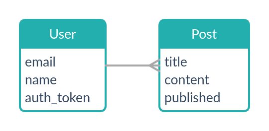

&nbsp;&nbsp;&nbsp;&nbsp;&nbsp;&nbsp;&nbsp;&nbsp;&nbsp;&nbsp;&nbsp;&nbsp;&nbsp;&nbsp;&nbsp;
&nbsp;&nbsp;&nbsp;&nbsp;&nbsp;&nbsp;&nbsp;&nbsp;&nbsp;&nbsp;&nbsp;&nbsp;&nbsp;&nbsp;&nbsp;
&nbsp;&nbsp;&nbsp;&nbsp;&nbsp;&nbsp;&nbsp;&nbsp;&nbsp;&nbsp;&nbsp;&nbsp;&nbsp;&nbsp;&nbsp;
&nbsp;&nbsp;&nbsp;&nbsp;&nbsp;&nbsp;&nbsp;&nbsp;&nbsp;&nbsp;&nbsp;&nbsp;&nbsp;&nbsp;&nbsp;
&nbsp;&nbsp;&nbsp;&nbsp;&nbsp;&nbsp;&nbsp;


## Codeando APIs al punto con RSpec.

Elimina el exceso de bugs para una vida más saludable

#### Lic. Magdiel Márquez Hernández

---

## Los bugs...

 En la comida... Jummm ¿¡Quizas!?

 En nuestro código, **¡No!**

---

## Los problemas con los bugs

- Estrés
- Ansiedad
- Depresión
- Perdida de sueño
- Burnout laboral o _Quemarse en el trabajo_

### [nobugsproject](https://nobugsproject.com)

---

## Los ingredientes

[Ruby](https://www.ruby-lang.org/es/) El lenguaje de programación


---

[Rails](https://rubyonrails.org/) El framework, la herramienta de trabajo


---

[RSpec](https://rspec.info/) Ayuda a implementar BDD o desarrollo guiado por comportamientos


---

[Shoulda Matchers](https://matchers.shoulda.io/) Simplifica nuestras pruebas, mejora la productividad


---

[factory bot](https://github.com/thoughtbot/factory_bot) Permite crear modelos de prueba.


---

[faker](https://github.com/faker-ruby/faker) Genera datos de prueba similares a los reales


[database_cleaner](https://github.com/DatabaseCleaner/database_cleaner) Limpia la base de datos al realizar las pruebas

---

## El mise en place

- Requerimientos y planeación
- Instalación y configuración
- Health endpoint: **Para monitorear la api**

---

## Requerimientos y planeación



---

## Instalación y configuración

[Codigo fuente](https://github.com/mmagdiel/test_blog)

```bash
rails new test_blog --api -T
```

Agregar en Gemfile

```ruby
group :development, :test do
    gem 'byebug', platforms: [:mri, :mingw, :x64_mingw]
    gem 'rspec-rails', '~> 4.0'
    gem 'factory_bot_rails', '~> 6.1'
    gem 'faker', '~> 2.14'
end
```

---

```ruby
group :test do
    gem 'shoulda-matchers', '~> 4.0'
    gem 'database_cleaner', '~> 1.8'
end
```

Instando las gemas y RSpec

```bash
bundle install
rails g rspec:install
```

Comando para probar

```bash
bundle exec rspec
```

---

spec/rails_helper.rb

```ruby
Shoulda::Matchers.configure do |config|
    config.integrate do |with|
        with.test_framework :rspec
        with.library :rails
    end
end
```

```ruby
RSpec.configure do |config|
    config.include FactoryBot::Syntax::Methods

    config.before(:suite) do
        DatabaseCleaner.strategy = :transaction
        DatabaseCleaner.clean_with(:truncation)
    end

    config.around(:each) do |example|
        DatabaseCleaner.cleaning do
                example.run
        end
    end
```

---

## Health endpoint

La prueba

```ruby
require "rails_helper"

RSpec.describe "Health endpoint", type: :request do
    describe "GET /health" do
        before { get '/health' }
        it "should return OK" do
            payload = JSON.parse(response.body)
            expect(payload).not_to be_empty
            expect(payload['api']).to eq('OK')
        end
        it "should return status code 200" do
            expect(response).to have_http_status(200)
        end
    end
end
```

---

Declarando la ruta

```ruby
Rails.application.routes.draw do
  # For details on the DSL available within this file, see https://guides.rubyonrails.org/routing.html
  get '/health', to: 'health#health'
end
```

El endpoint

```ruby
class HealthController < ApplicationController
  def health
    render json: {api: 'OK'}, status: :ok
  end
end
```

---

## Construyendo la API

```bash
rails g model user email:string name:string auth_token:string
rails g model post title:string content:string published:boolean user:references
rails db:migrate
```

```ruby
require 'rails_helper'

RSpec.describe User, type: :model do
    describe "validations" do
        it "validate presence of required fields" do
            should validate_presence_of(:email)
            should validate_presence_of(:name)
            should validate_presence_of(:auth_token)
        end
        it "validate relations" do
            should have_many(:posts)
        end
    end
end
```

---

```ruby
require 'rails_helper'

RSpec.describe Post, type: :model do
    describe "validations" do
        it "validate presence of required fields" do
                should validate_presence_of(:title)
                should validate_presence_of(:content)
                should validate_presence_of(:user_id)
        end
    end
end
```

---

```ruby
FactoryBot.define do
    factory :post do
        title { Faker::Lorem.sentence }
        content { Faker::Lorem.paragraph }
        published { rand(0..1) == 0 ? false : true }
    end
end
```

```ruby
FactoryBot.define do
    factory :user do
        email { Faker::Internet.email }
        name { Faker::Name.name }
        auth_token { "xxxxxxxx" }
    end
end
```

---

Agregando el Codigo

```ruby
class User < ApplicationRecord
    has_many :posts
    validates :email, presence: true
    validates :name, presence: true
    validates :auth_token, presence: true
end
```

```ruby
class Post < ApplicationRecord
    belongs_to :user
    validates :title, presence: true
    validates :content, presence: true
    validates :published, inclusion: { in: [true, false] }
    validates :user_id, presence: true
end
```

---

```ruby
require "rails_helper"

RSpec.describe "post endpoint", type: :request do

    describe "GET /posts" do
        describe "without data in the BD" do
            before { get '/posts' }
            it "should return OK" do
                payload = JSON.parse(response.body)
                expect(payload).to be_empty
                expect(response).to have_http_status(200)
            end
        end

        describe "with data in the BD" do
            let!(:posts) { create_list(:post, 10, published: true) } # create_list: factory bot, let: rspec
            before { get '/posts' }
            it "should return status code 200" do
                payload = JSON.parse(response.body)
                expect(payload).to_not be_empty
                expect(payload.size).to eq(posts.size)
                expect(response).to have_http_status(200)
            end
        end
    end
...
end
```

---

```ruby
...
    describe "GET /posts/{id}" do
        let!(:post) { create(:post) }
        it "should return a post" do
                get "/posts/#{post.id}"
                payload = JSON.parse(response.body)
                expect(payload).to_not be_empty
                expect(payload["id"]).to eq(post.id)
                expect(response).to have_http_status(200)
        end
    end
...
```

---

```ruby
Rails.application.routes.draw do
    # For details on the DSL available within this file, see https://guides.rubyonrails.org/routing.html
    get '/health', to: 'health#health'
    resources :posts, only: [:index, :show]
end
```

```ruby
class PostsController < ApplicationController
    # GET /posts
    def index
        @posts = Post.where(published: true)
        render json: @posts, status:  :ok
    end
    # Get /posts/{id}
    def show
        @post = Post.find(params[:id])
        render json: @post, status:  :ok
    end
end
```

---

### Muchas Gracias por su atención
